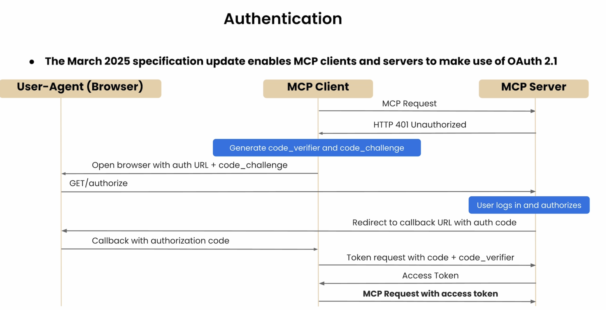
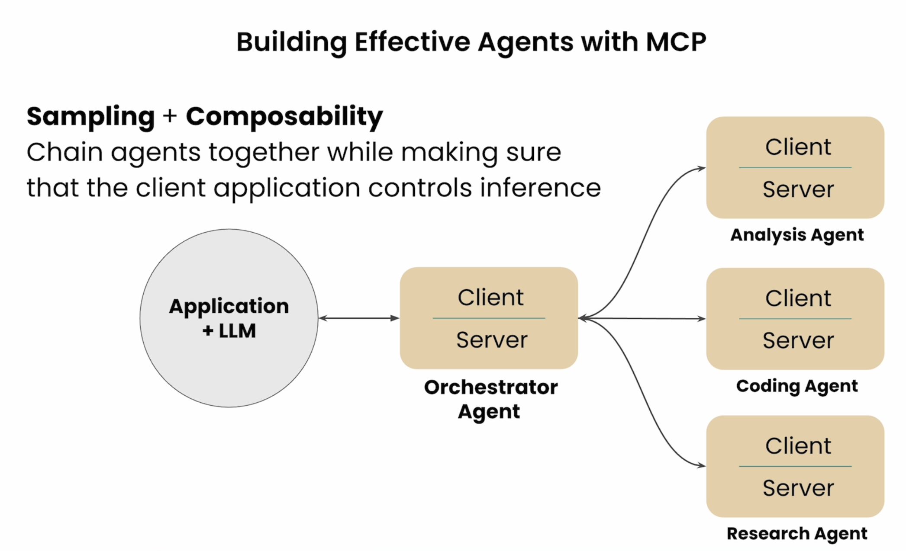

# Conclusion

Not covered

## Authentication

MCP client and servers can use OAuth 2.1

## Roots

Specify folders or URIs to look in.

Benefits

- Security
- Relevance

## Sampling

Allow a server to request inference from the LLM. It talks directly to the LLM instead of providing all details back to the client. Example
client - investigate error on server
MCP server - access logs, find issue
MCP server calls -> LLM to help diagnose the issue.

Concerns: security, privacy, and cost

## MCP will be the foundational protocol for Agents

### Composability

## Official MCP Registry API

- Discovery
- Centralization
- Verification
- Versioning

### Self-Evolving Agents

Agents can discover MCP servers

Agent checks website for

`.well-known/mcp.json`

